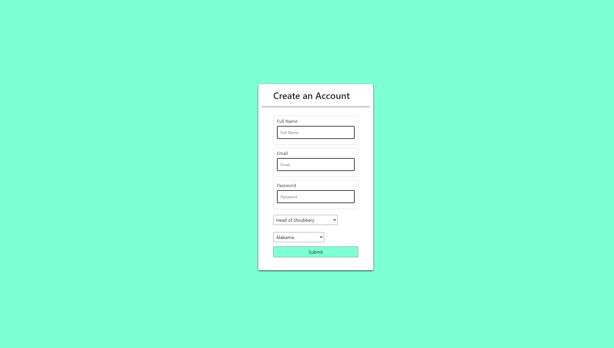

# User-Creation-Form

## Overview
This repository is for a webpage to display a form that does not allow form submission without having been completed. The form data will the be posted to an endpoint.

## Table of Contents

1. [Installation](#installation)

2. [Usage](#usage)

3. [Contributions](#contribution)

4. [Test Instructions](#test-instructions)

5. [Screenshots](#screenshots)

6. [Licenses](#licenses)

7. [Questions](#questions)

## Installation

 git clone the repo 

## Usage

Click on the form boxes and fill out the information. Then, click submit and the bottom to send your data to the endpoint.

## Contribution

none

## Test Instructions

none

## Screenshots

## License

    
## Questions? Contact Me!

My GitHub is [bo-stevenson](https://www.github.com/bo-stevenson).

My email is [bostevenson1027@gmail.com](mailto:bostevenson1027@gmail.com).
